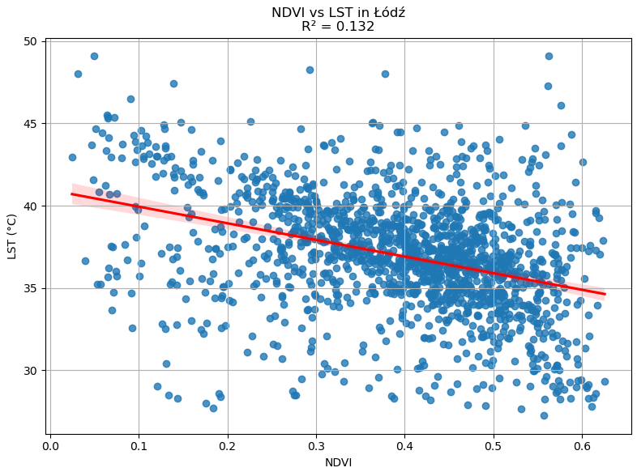

# Urban Heat Island Mapping — Łódź

This project presents an interactive web-based visualization of the **Urban Heat Island (UHI)** phenomenon in the city of **Łódź, Poland**, using **NDVI**, **Land Surface Temperature (LST)**, and **grid-based statistical analysis**.

The application is part of an academic research project and supports spatial exploration, visual comparison, and interpretation of urban heat patterns.

---

## 🌍 Live Application
👉 https://suadarzimanli.github.io/urban-heat-island-lodz/
---

## 📊 Data & Methods (summary)

- **NDVI** derived from satellite imagery
- **LST** calculated from thermal bands
- Raster layers classified into discrete intensity classes
- Aggregation into a regular grid:
  - Median NDVI
  - Mean LST
- Statistical correlation analysis performed in Python  
  (**R² = 0.132** for this snapshot)

Detailed preprocessing was conducted using **ArcGIS Pro** and **Python (Pandas, SciPy)**.

---

## 🖥️ Application Features

- Toggleable NDVI and LST raster layers (GeoTIFF)
- Adjustable opacity controls
- Grid-based statistics with popups
- Interactive legend
- Map export (PNG)
- Keyboard shortcuts for rapid comparison

---

## 📁 Project Structure
index.html - css/style.css - js/script.js - data/NDVI_classified.tif - LST_classified.tif - lodz_city.geojson - lodz_grid.geojson - ndvi_lst_grid_stats.csv - images/ndvi_vs_lst_lodz_cleaned.png

---

## 🧪 Regression Analysis

The relationship between NDVI and LST was evaluated using linear regression in Python.

---

## ⚖️ License & Citation

This repository is intended for **academic use**.

If you use or reference this work, **please cite the author**.

> © 2026 — Research project by *Suad Arzimanli*

